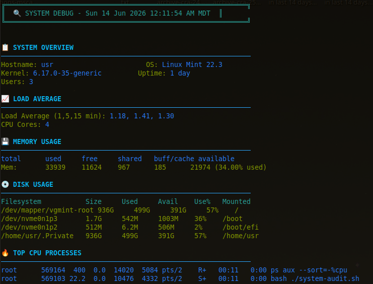
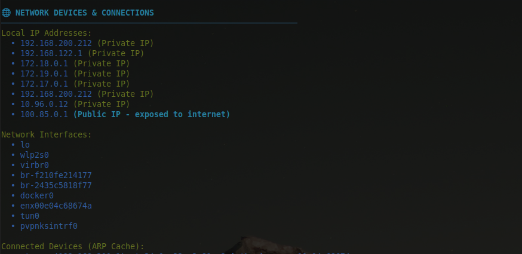
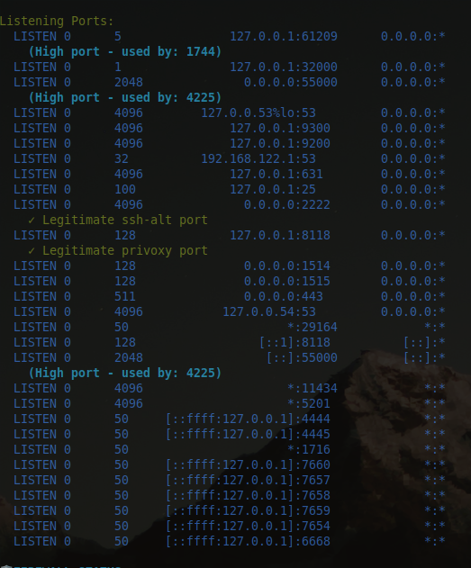
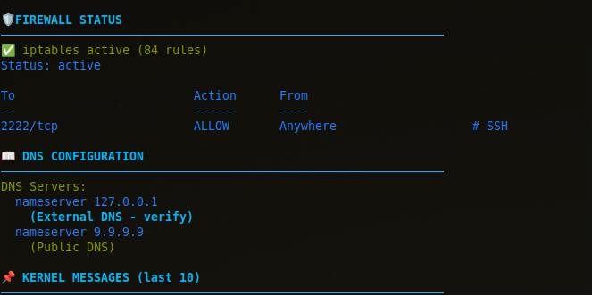
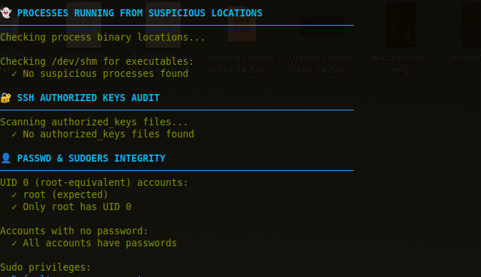
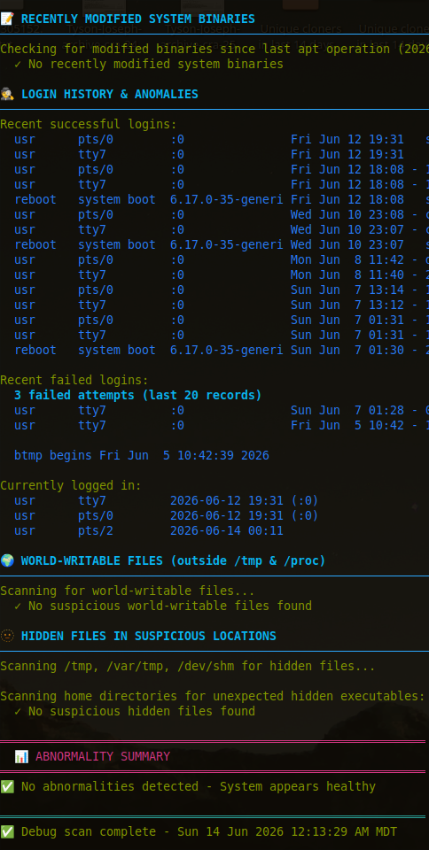
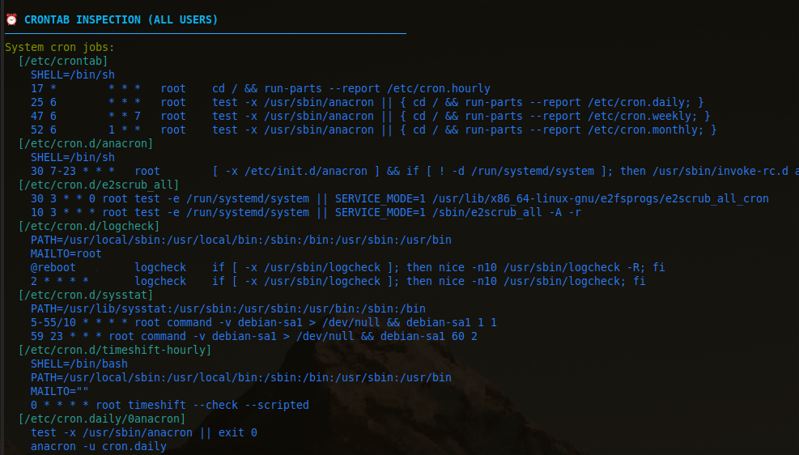

# 🔍 System Debug & Security Audit Script

A comprehensive system debugging tool with network device discovery, anomaly detection, and security auditing capabilities.


## 🔒 Also Check Out
[Ultimate System Hardening Script](https://github.com/Kal1010101/ultimate-sys-hardening) - CIS-aligned security hardening

## ⭐ Support This Project
If this script helped you, please consider starring this repository!
It helps others find it and motivates continued development.

**113 sysadmins have already cloned this script in the last 14 days.** Join them!

## Features

| Category | Checks |
|----------|--------|
| **Network** | Active connections, listening ports, ARP cache, DNS config, firewall status |
| **Security** | SUID binaries, SSH keys, cron jobs, sudoers, world-writable files |
| **System** | CPU/Memory/Disk usage, top processes, load average, kernel messages |
| **Threat Detection** | Suspicious ports, ARP spoofing, hidden files, processes from /tmp |

## Requirements

- **OS:** Linux (Ubuntu, Debian, RHEL, Arch) or macOS
- **Privileges:** Root/sudo recommended for full access
- **Dependencies:** `ss`, `ip`, `arp`, `lsof` (installed by default on most systems)

## What It Detects

- 🚨 Suspicious listening ports (backdoors, trojans)
- 🚨 Processes running from /tmp or /dev/shm
- 🚨 ARP spoofing attempts
- 🚨 Unauthorized SUID/SGID binaries
- 🚨 Suspicious cron jobs
- 🚨 World-writable files
- 🚨 Hidden executables in home directories
- 🚨 Passwordless sudo rules
- 🚨 High CPU/memory usage
- 🚨 Failed login attempts (brute force)

## Screenshots

<details>
<summary>📸 Click to view screenshots</summary>

| Section | Screenshot |
|---------|------------|
| System Overview |  |
| Network Analysis |  |
| Listening Ports |  |
| Firewall Status |  |
| Process Monitor |  |
| Login History |  |
| Cron Jobs |  |

</details>

## Quick Start
```bash
# Clone the repository
git clone https://github.com/Kal1010101/sysdebug.git
cd sysdebug

# Run as root (required for full access)
sudo ./sysdebug.sh

# Quick mode (skips slow checks)
sudo ./sysdebug.sh --quick

# Plain text output (no colors)
sudo ./sysdebug.sh --no-color
'''
